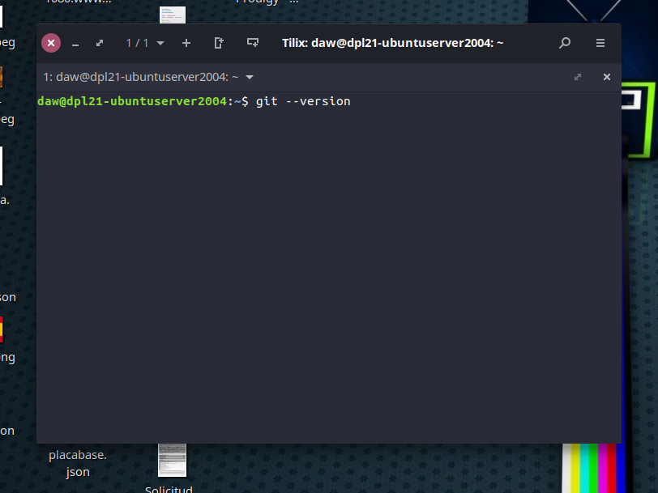
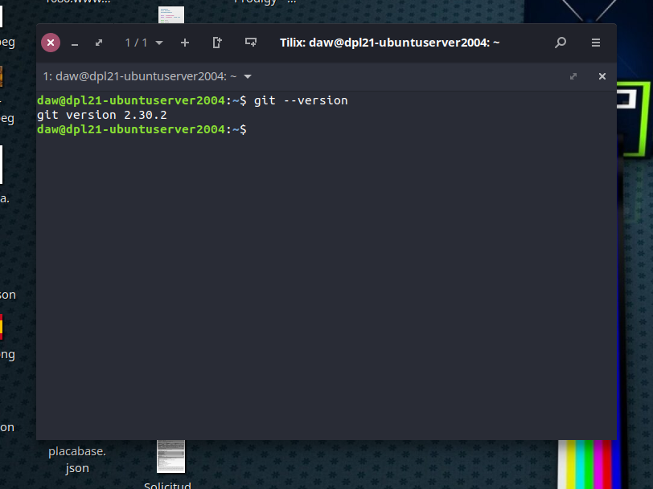

# Control de versionado GIT

Git es un software de control de versiones diseñado por Linus Tovalds (padre del kernel Linux), eficiente, confiable y facilita mucho las tareas de mantenimiento de versiones de nuestro software.

- Rápida gestion de las ramas y mezclado de diferentes versiones. Git incluye herramientas específicas para navegar y visualizar un historial de desarrollo no lineal.
- Es un sistema distribuido lo que significa que cada persona tendrá una copia del repositorio en su máquina local, y los cambios se propagan entre los repositorios locales. Los cambios se importan como ramas adicionales y pueden ser fusionados en la misma manera que se hace con la rama local. Lo que lo hace perfecto para sincronizar equipos de trabajo.
- Posee una gran versatilidad a la hora de de establecer conexiones, es compatible con los protocolos HTTP, FTP, rsync o mediante un protocolo nativo, a través de TCP/IP o a través de cifrado SSH. Git además es capaz de emular repositorios CVS.

Estas son algunas de sus caracteristicas. Lo que lo convierte en una herramienta indispensable para cualquier proyecto de dimensiones considerables.

---
> **_Fuente:_** [Wikipedia](https://es.wikipedia.org/wiki/Git)
---

### Instalación

Primero compruebo si mi sistema tiene instalado git introduciendo este comando:

```shell:
git --version
```


Si obtenemos esta salida en terminal es que ya lo tenemos instalado

    git version 2.30.2


En caso contrado ingresamos los siguientes comandos en nuestra shell:

```
sudo apt update && sudo apt install git
```

